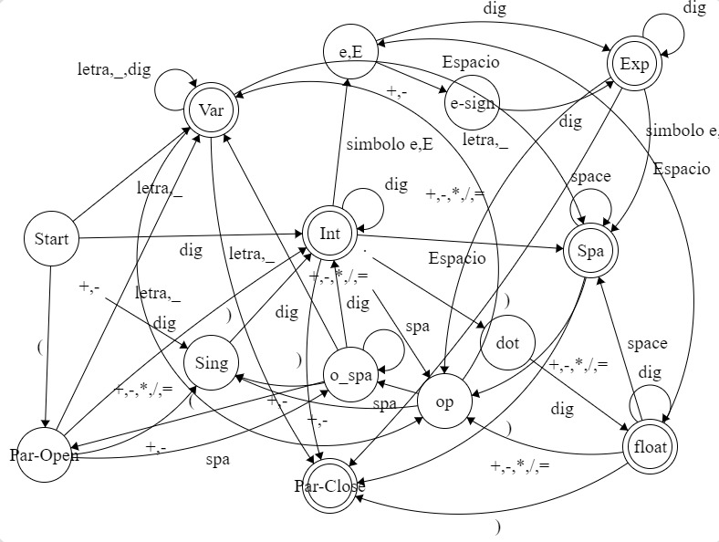
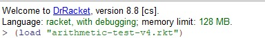
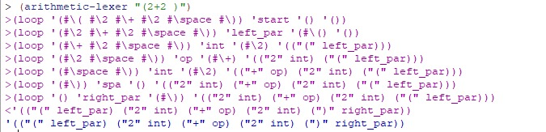
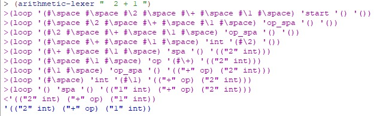
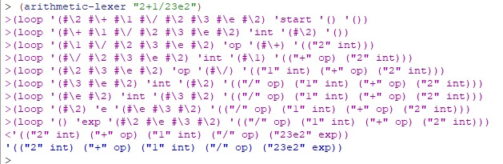

# Manual de Usuario

## Descripción del programa

Un dfa es un automata finito determinista es decir, para cada estado en que se encuentre el autómata, y con cualquier símbolo del alfabeto leído, existe siempre no más de una transición posible desde ese estado y con ese símbolo

Creamos un diagrama que nos permitiera definir las reglas de nuestro lenguaje, asi como los diferentes estados de aceptacion que validen las transiciones de nuestro automata.

Para este DFA hicimos una función que analiza strings que contengan expresiones aritméticas, para luego retornar una lista con cada uno de los tokens encontrados e indicando de qué tipo son. 

Los tokens que identifica el automata son:

1. Variables
2. Operadores 
3. Numeros Enteros
4. Numero Flotantes
5. Numeros Exponeneciales
6. Parentesis

## Instalación

Para instalar el programa, sigue los siguientes pasos:

1. Descarga e instala Racket: Para correr el programa del DFA en Racket, necesitarás tener instalado el lenguaje en tu computadora. Puedes descargar Racket desde la página oficial: https://racket-lang.org/.
2. Después deberas descargar el archivo de <b>Actividad_dfa.rkt</b> además del archivo de prueba que es <b>arithmetic-test-v4.rkt</b>, para asi hacer las pruebas necesarias.

## Uso

Para hacer las pruebas del programa, sigue los siguientes pasos:

1. Abre tu compilador de Racket.
2. Abre ambos documentos 
3. Ejecuta el siguiente comando: `(load "arithmetic-test-v4.rkt)`.
4. Al usar esto debe salir el mismo resultado en la terminal como se muestra abajo.

## Ejemplo de uso

Esto es lo que debes de escribir en la terminal para poder compilar el archivo para correr las preubas.

Algunos de las pruebas con sus resultados son:

